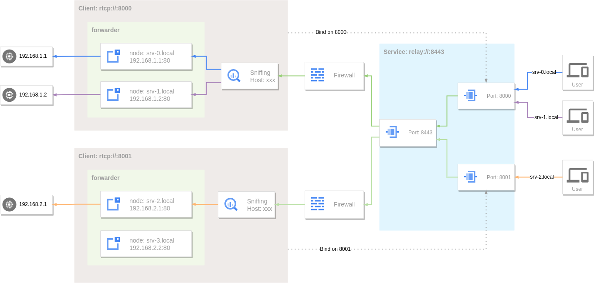
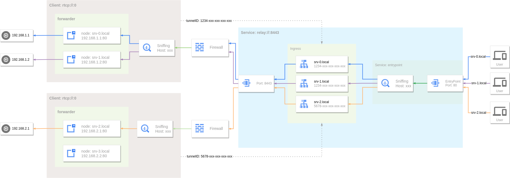

---
authors:
  - ginuerzh
categories:
  - Reverse Proxy
readtime: 30
date: 2023-01-16
comments: true
---

# 反向代理与内网穿透

反向代理也是代理服务的一种，我们通常使用的代理服务，例如HTTP/SOCKS5代理，其代理的目标是客户端，代理服务代替客户端与所访问的服务器建立连接，而反向代理服务代理的目标是服务器，因此像HTTP/SOCKS5这种代理服务也被称作正向代理。二者的主要却别在于正向代理中客户端是知道代理服务的存在，而反向代理中客户端(甚至是服务端)是不知道代理服务的存在，在客户端看来代理服务就是我真正要访问的服务。

从某种角度来看，反向代理与端口转发是一样的，二者都是在两个端口之间建立映射关系，将数据从一个端口转发到另外一个端口，只不过反向代理会利用转发的数据进行更精确的控制，而端口转发一般不会依赖于数据的内容，仅仅是纯粹的端到端的转发行为。GOST中的反向代理就是基于端口转发来实现的。

<!-- more -->

GOST从v2.1版本开始就已经实现了[端口转发](https://v2.gost.run/port-forwarding/)的功能，其间这个功能一直没有多大的变化，直到v3.0.0-rc.1版本，为了实现[反向代理](https://gost.run/tutorials/reverse-proxy/)的功能而对端口转发进行了扩展。

## 反向代理

GOST中的端口转发原本是不会对转发的数据进行解析，而反向代理特别是针对Web服务的反向代理，一般需要我们根据所要访问的主机名(或域名)来对流量进行路由，这个主机名就需要从所要转发的数据中获取，如果是HTTP流量对应的是HTTP头部的Host字段，如果是HTTPS流量对应的是TLS握手协议中的SNI信息。

 

GOST中端口转发服务开启流量嗅探(sniffing选项)后便能够对数据进行进一步解析获取所要访问的目标主机名，再与转发器中定义的目标服务进行主机名匹配找到最终要转发到的目标服务。此时的端口转发更像是一个[SNI代理](https://gost.run/tutorials/protocols/sni/)，区别在于SNI代理更像是一个正向代理，对其所转发的目标主机一般不会有太多限制，而反向代理中的目标主机一般是预定义的一组服务。

```yaml hl_lines="7 14 17"
services:
- name: service-0
  addr: :80
  handler:
    type: tcp
    metadata:
      sniffing: true
  listener:
    type: tcp
  forwarder:
    nodes:
    - name: example-com
      addr: example.com:80
      host: example.com
    - name: example-org
      addr: example.org:80
      host: example.org
```

```bash
curl --resolve example.com:80:127.0.0.1 http://example.com
```

这里反向代理可以看作是目标主机(example.com)的镜像，用户访问代理服务与访问目标主机没有什么区别。

## 内网穿透

上面所说的反向代理能够工作的一个前置条件是反向代理能够直接访问到目标主机，如果目标主机处于内网且没有公网IP，以上方式就无效了。这种情况就需要进行内网穿透，让内网的主机主动与具有公网IP的主机建立一个连接，当数据发送给具有公网IP的主机后，再通过这个连接转发给内网中的目标主机。

 

GOST中的远程端口转发正是做这件事的，因此远程端口转发也同样支持了对流量进行嗅探，并能够根据主机名来路由流量。

```yaml hl_lines="7 15 18"
services:
- name: http
  addr: :80
  handler:
    type: rtcp
    metadata:
      sniffing: true
  listener:
    type: rtcp
    chain: chain-0
  forwarder:
    nodes:
    - name: srv-0
      addr: 192.168.1.1:80
      host: srv-0.local
    - name: srv-1
      addr: 192.168.1.2:80
      host: srv-1.local
chains:
- name: chain-0
  hops:
  - name: hop-0
    nodes:
    - name: node-0
      addr: SERVER_IP:8443 
      connector:
        type: tunnel
      dialer:
        type: tcp
```

```bash
curl --resolve srv-1.local:80:SERVER_IP http://srv-1.local
```

## 内网穿透-加强版

以上的内容已经基本上实现了一个简单的反向代理服务，但是针对需要内网穿透的Web服务反向代理还有不足之处。一般的Web反向代理(例如Nginx，Traefik)对外只会暴露固定的几个预定义的端口作为入口(例如80，443)，并且入口点流量的路由控制权应当是在服务端。而以上的远程端口转发，入口和路由的定义都是在客户端，这样对于整个服务来说不可控。

 

GOST在v3.0.0-rc.3版本中通过对[Relay协议](https://gost.run/tutorials/protocols/relay/)的扩展，增强了内网穿透的功能，使其能够更好的适配反向代理。

### 服务端

```yaml hl_lines="7 8"
services:
- name: service-0
  addr: :8443
  handler:
    type: tunnel
    metadata:
      entrypoint: ":80"
      ingress: ingress-0
  listener:
    type: tcp

ingresses:
- name: ingress-0
  rules:
  - hostname: "srv-0.local"
    endpoint: 4d21094e-b74c-4916-86c1-d9fa36ea677b
  - hostname: "srv-1.local"
    endpoint: 4d21094e-b74c-4916-86c1-d9fa36ea677b
  - hostname: "srv-2.local"
    endpoint: ac74d9dd-3125-442a-a7c1-f9e49e05faca
```

### 客户端

```yaml hl_lines="29"
services:
- name: service-0
  addr: :0
  handler:
    type: rtcp
    metadata:
      sniffing: true
  listener:
    type: rtcp
    chain: chain-0
  forwarder:
    nodes:
    - name: local-0
      addr: 192.168.1.1:80
      host: srv-0.local
    - name: local-1
      addr: 192.168.1.2:80
      host: srv-1.local
chains:
- name: chain-0
  hops:
  - name: hop-0
    nodes:
    - name: node-0
      addr: SERVER_IP:8443 
      connector:
        type: tunnel
        metadata:
          tunnel.id: 4d21094e-b74c-4916-86c1-d9fa36ea677b
      dialer:
        type: tcp
```

### 入口点(EntryPoint)

入口点指定了流量的入口，所有用户的流量统一由入口点进入。当设定了入口点后处理器内部会创建一个监听在入口点的服务，用户的流量到达入口点后，此服务内部会对流量进行嗅探，获取请求的目标主机，再对流量做相应的路由。

### 隧道(Tunnel)

隧道是内网穿透中客户端与服务端之间建立的(逻辑上的)通道，每个隧道都有一个唯一ID(合法的UUID)，一个隧道可以有多个连接，当多个客户端使用相同的隧道ID建立连接时，这些连接被归属于同一个隧道。服务端会从隧道的多个连接中选择一个可用的连接进行数据转发。

### Ingress

[Ingress](https://gost.run/concepts/ingress/)定义了入口点进入的流量的路由规则，每个规则是主机名到隧道的映射，例如访问srv-0.local和srv-1.local的流量都会被路由到隧道4d21094e-b74c-4916-86c1-d9fa36ea677b，访问srv-2.local的流量会被路由到隧道ac74d9dd-3125-442a-a7c1-f9e49e05faca。

!!! note "隧道ID分配"
    隧道的ID应当由服务端提前分配并记录在Ingress中，如果客户端使用了一个未在Ingress中注册的隧道ID，则流量无法路由到此客户端。

### 加密

隧道依赖于Relay协议，Relay协议本身不具备数据加密的功能，可以通过与各种具有加密功能的[数据通道](https://gost.run/tutorials/protocols/overview/#_5)例如TLS，gRPC，QUIC等组合使用来对整个隧道进行加密。

