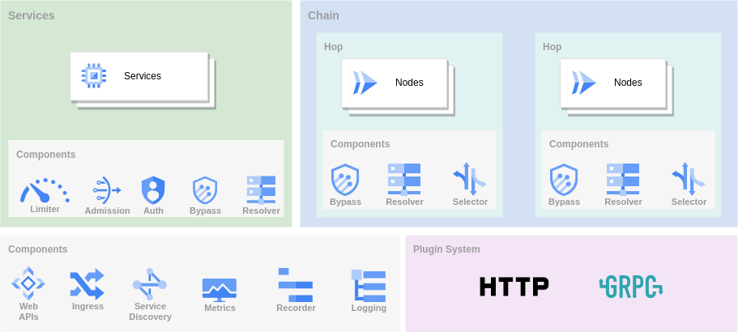
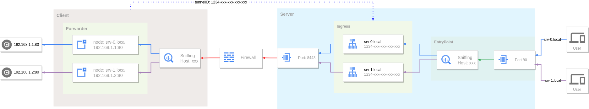

# GO Simple Tunnel

## GO语言实现的安全隧道

## 功能特性

- [x] 多端口监听
- [x] 多级转发链
- [x] 多协议支持
- [x] TCP/UDP端口转发
- [x] 反向代理和隧道
- [x] TCP/UDP透明代理
- [x] DNS解析和代理
- [x] TUN/TAP设备
- [x] 负载均衡
- [x] 路由控制
- [x] 限速限流
- [x] 准入控制
- [x] 插件系统
- [x] 监控指标
- [x] 动态配置
- [x] Web API
- [x] GUI/WebUI

## 概览



GOST作为隧道有三种主要使用方式。

### 正向代理

作为代理服务访问网络，可以组合使用多种协议组成转发链进行转发。


### 端口转发

将一个服务的端口映射到另外一个服务的端口，同样可以组合使用多种协议组成转发链进行转发。


### 反向代理

利用隧道和内网穿透将内网服务暴露到公网访问。



## 下载安装

### 二进制文件

[https://github.com/go-gost/gost/releases](https://github.com/go-gost/gost/releases)

### 源码编译

```
git clone https://github.com/go-gost/gost.git
cd gost/cmd/gost
go build
```

### Docker

```
docker run --rm gogost/gost -V
```

## 工具

### GUI

[go-gost/gostctl](https://github.com/go-gost/gostctl)

### WebUI

[ui.gost.run](https://ui.gost.run)

[go-gost/gost-ui](https://github.com/go-gost/gost-ui)

### Shadowsocks Android插件

[hamid-nazari/ShadowsocksGostPlugin](https://github.com/hamid-nazari/ShadowsocksGostPlugin)


## 帮助与支持

GitHub：[https://github.com/go-gost/gost/issues](https://github.com/go-gost/gost/issues)

YouTube: [https://www.youtube.com/@gost-tunnel](https://www.youtube.com/@gost-tunnel)

Telegram：[https://t.me/gogost](https://t.me/gogost)

Google讨论组：[https://groups.google.com/d/forum/go-gost](https://groups.google.com/d/forum/go-gost)

旧版入口：[v2.gost.run](https://v2.gost.run)
