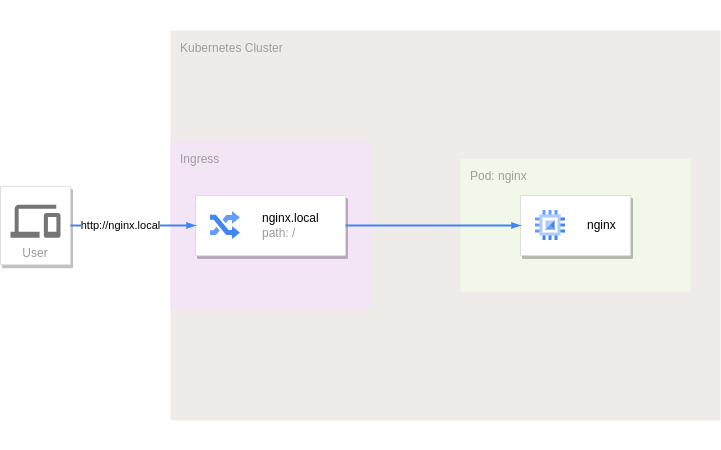
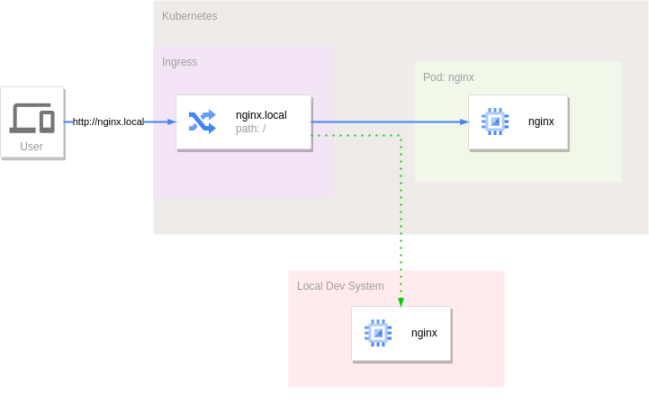
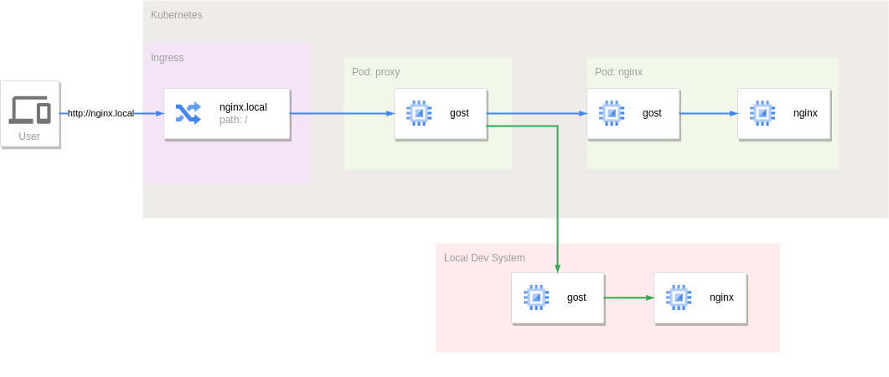
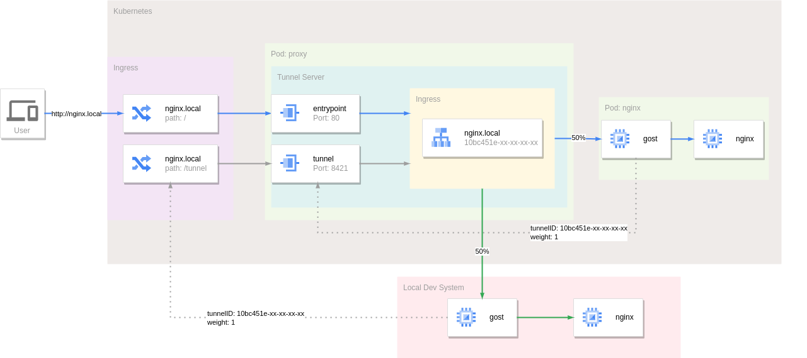

---
authors:
  - ginuerzh
categories:
  - Reverse Proxy
readtime: 15
date: 2024-01-29
comments: true
---

# Local Debugging of K8s Services Using Reverse Proxy Tunnel

Cloud-native technologies like containers and Kubernetes make service deployment and management more flexible and convenient. However, debugging applications running in a Kubernetes cluster can be challenging.

Tools like [Telepresence](https://www.telepresence.io/) solve this by intercepting service traffic and forwarding it to a local service. We can achieve similar functionality using the [reverse proxy tunnel](https://gost.run/tutorials/reverse-proxy-tunnel/).

<!-- more -->

Assume we have an Nginx service running in a cluster, accessible via the hostname `nginx.local` defined by an Ingress. If the cluster entry IP is `192.168.1.1`:

```bash
curl --resolve nginx.local:80:192.168.1.1 http://nginx.local
```



To debug this service locally, we need to intercept and split the traffic from the Ingress to the Nginx service — similar to what Telepresence does.



The reverse proxy tunnel acts as both a reverse proxy and a tunnel, forwarding incoming traffic to the other end. The approach: deploy a reverse proxy tunnel service in front of Nginx to intercept all traffic originally destined for Nginx. Run the reverse proxy tunnel client as a sidecar in the Nginx pod, connecting back to the tunnel service. By default, all traffic flows through the tunnel to the in-cluster Nginx service.

The reverse proxy tunnel supports high availability — a single tunnel can have multiple client connections. Running another tunnel client locally with the same tunnel ID splits traffic to the local service.



Configuration:

```yaml
apiVersion: v1
kind: Service
metadata:
  name: proxy
spec:
  selector:
    app: proxy
  ports:
    - name: tunnel
      protocol: TCP
      port: 8421
      targetPort: tunnel
    - name: entrypoint
      protocol: TCP
      port: 80
      targetPort: entrypoint
---
apiVersion: apps/v1
kind: Deployment
metadata:
  name: proxy
spec:
  replicas: 1
  selector:
    matchLabels:
      app: proxy
  template:
    metadata:
      labels:
        app: proxy
    spec:
      containers:
        - name: gost
          image: gogost/gost
          args:
            - "-L"
            - "tunnel+ws://:8421?entrypoint=:80&tunnel=nginx.local:10bc451e-59dc-4c70-999e-91a30813ac78&path=/proxy"
          ports:
            - name: tunnel
              containerPort: 8421
            - name: entrypoint
              containerPort: 80
---
apiVersion: apps/v1
kind: Deployment
metadata:
  name: nginx
spec:
  replicas: 1
  selector:
    matchLabels:
      app: nginx
  template:
    metadata:
      labels:
        app: nginx
    spec:
      containers:
        - name: gost
          image: gogost/gost
          args:
            - "-L"
            - "rtcp://:0/:80"
            - "-F"
            - "tunnel+ws://proxy:8421?tunnel.id=10bc451e-59dc-4c70-999e-91a30813ac78&tunnel.weight=1&path=/proxy"
        - name: nginx
          image: nginx:alpine
---
apiVersion: networking.k8s.io/v1
kind: Ingress
metadata:
  name: nginx
spec:
  rules:
    - host: nginx.local
      http:
        paths:
          - path: /
            pathType: Prefix
            backend:
              service:
                name: proxy
                port:
                  name: entrypoint
          - path: /proxy
            pathType: Prefix
            backend:
              service:
                name: proxy
                port:
                  name: tunnel
```

The reverse proxy tunnel service defines two ports: `entrypoint` (80) for external traffic and `tunnel` (8421) for tunnel client connections.

Since WebSocket is used, external tunnel clients can connect through the Ingress via the `/proxy` path. To split traffic locally:

```bash
gost -L rtcp://:0/:80 -F "tunnel+ws://192.168.1.1:80?tunnel.id=10bc451e-59dc-4c70-999e-91a30813ac78&tunnel.weight=1&path=/proxy&host=nginx.local"
```



The `weight` parameter controls tunnel connection weights. When multiple clients connect to the same tunnel, the server uses weighted random selection — higher weight = higher selection probability (range: [1,255]). In the example above, both clients have weight 1, so each receives 50% of traffic.

With weight `255`, clients with lower weights are excluded, and all traffic goes to the weight-255 client — useful for intercepting all traffic locally.


## Summary

Compared to Telepresence:

**Advantages:**

* **Simple, low invasiveness.** Unlike Telepresence's VPN mode, reverse proxy tunnels don't fully expose the cluster network — they selectively redirect traffic through the normal Ingress entry point.
* **Dynamic, seamless traffic switching.** Both use a sidecar pattern. Telepresence injects an agent pod dynamically when intercepting, causing service restarts. Reverse proxy tunnels inject the tunnel client in advance, with traffic splitting handled dynamically by the server — no impact on the intercepted service.
* **No local system requirements.** Telepresence requires root for its daemon service; reverse proxy tunnel clients have no such requirement.

**Disadvantages:**

* **Single function.** Reverse proxy tunnels only intercept and forward traffic. Telepresence can map traffic, environment variables, Secrets, ConfigMaps, and even filesystems locally.
* **Difficult to access in-cluster services.** The reverse proxy tunnel doesn't fully connect to the cluster network, so it can't directly access other services like it would from within the cluster.
* **No precise traffic splitting.** Telepresence offers [Personal intercepts](https://www.getambassador.io/docs/telepresence/latest/concepts/intercepts#personal-intercept) for more precise traffic splitting, which the reverse proxy tunnel currently cannot achieve.
