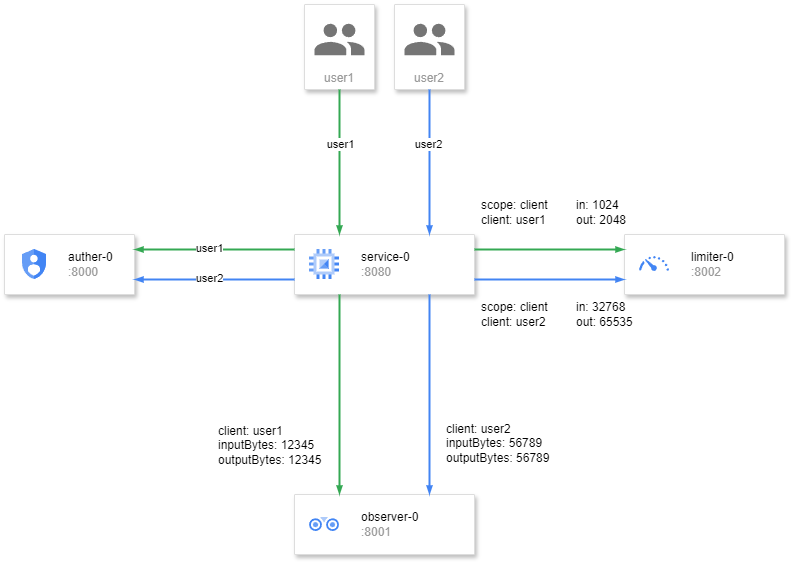

---
authors:
  - ginuerzh
categories:
  - Limiter
  - Observer
readtime: 10
date: 2024-09-04
comments: true
---

# User-Level Traffic Statistics and Dynamic Rate Limiting

GOST's [Observer](https://gost.run/concepts/observer/) component collects connection and traffic statistics. When configured, it periodically reports total input/output bytes as events. The [Limiter](https://gost.run/concepts/limiter/) component enforces connection and traffic limits.

Sometimes finer-grained traffic management is needed. For example, an authenticated proxy service may require per-user traffic statistics or rate limiting, possibly with dynamic adjustments based on real-time usage. Since different scenarios may have complex logic, GOST doesn't provide built-in user-level limiting — instead, it exposes a plugin interface for custom implementations.

<!-- more -->

For authenticated handlers (HTTP, HTTP2, SOCKS4, SOCKS5, Relay), the observer and traffic limiter can work together with the [Auther](https://gost.run/concepts/auth/) component to implement flexible user-level dynamic rate limiting.

The observer on a handler groups traffic by user identity (from the auther) and reports per-user statistics via plugins. The traffic limiter on a handler similarly queries plugins for per-user limiting configuration. The traffic limiter plugin can optionally use observer data to dynamically adjust individual user limits.



```yaml
services:
  - name: service-0
    addr: :8080
    handler:
      type: http
      auther: auther-0
      observer: observer-0
      limiter: limiter-0
    listener:
      type: tcp
authers:
  - name: auther-0
    plugin:
      type: http
      addr: http://localhost:8000/auther
observers:
  - name: observer-0
    plugin:
      type: http
      addr: http://localhost:8001/observer
limiters:
  - name: limiter-0
    plugin:
      type: http
      addr: http://localhost:8002/limiter
```
