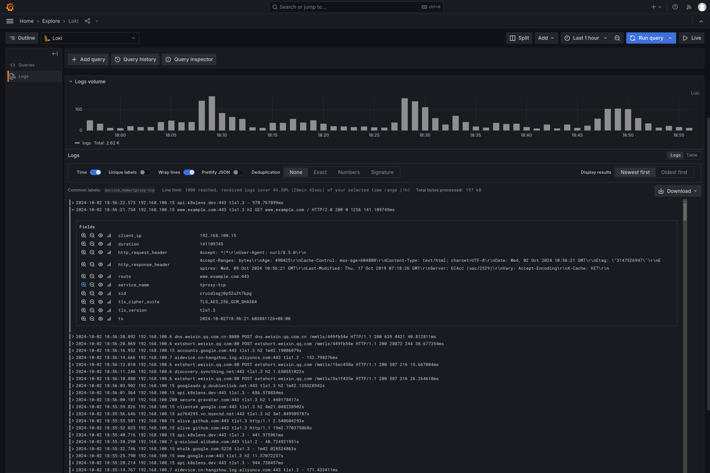
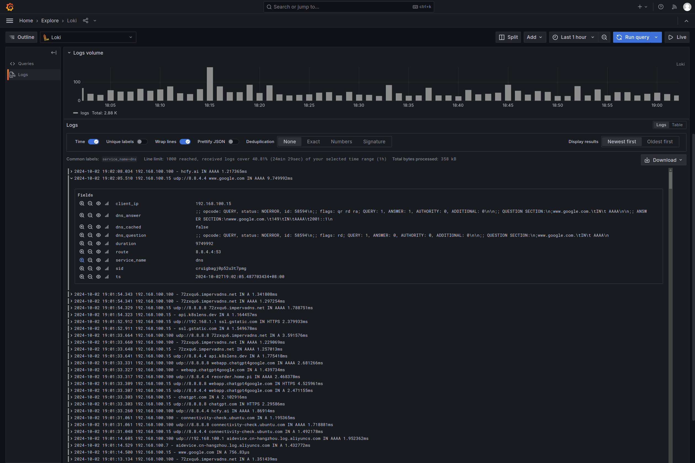

---
authors:
  - ginuerzh
categories:
  - Logging
readtime: 10
date: 2024-09-16
comments: true
---

# Logging in GOST

Program logs are valuable for both developers and users. For developers, they help quickly locate issues. For users, logs can be shared with developers for problem analysis, and can also be used for usage statistics and analysis. Logs are also a core component of [observability](https://opentelemetry.io/docs/concepts/observability-primer/).

<!-- more -->

## General Logging

GOST's [logging module](https://gost.run/tutorials/log/) records operational information at various levels: basic connection info (INFO), traffic routing details (DEBUG), and detailed request/response data (TRACE). INFO is suitable for most cases; DEBUG or TRACE can help when troubleshooting.

GOST logs are structured data, output in JSON format by default. Each request-related log entry includes a `sid` field, which is consistent within a single request and unique across requests, enabling per-request tracing.

Example: a request to `https://www.example.com` through the proxy service (`:8080`) via a forwarding node (`:18080`):

```json
{"caller":"http/handler.go:116","handler":"http","kind":"handler","level":"info","listener":"tcp","local":"[::1]:8080","msg":"[::1]:49028 <> [::1]:8080","remote":"[::1]:49028","service":"service-0","sid":"crk2moqohhhqs5e7v3d0","time":"2024-09-16T20:58:11.267+08:00"}
```

## Log Analysis

When log volumes are large, querying and analyzing becomes non-trivial. Common approaches include using open-source [ELK](https://www.elastic.co/elastic-stack), [Grafana Loki](https://grafana.com/oss/loki/), or commercial solutions like [DataDog](https://www.datadoghq.com/). These tools natively support parsing structured JSON logs, which is why GOST defaults to JSON format.

## Business Logs — Recorder

General logging covers most scenarios, but some cases require more targeted data. For example, a web service may need to record every HTTP request's status data — doing this with general logging would require complex secondary processing.

GOST's [Recorder](https://gost.run/concepts/recorder/) component addresses this. It functions similarly to general logging but can output business-oriented data for different needs.

Example: a web reverse proxy service configured with a handler recorder:

```yaml
services:
  - name: service-0
    addr: :8000
    recorders:
      - name: recorder-0
        record: recorder.service.handler
    handler:
      type: tcp
      metadata:
        sniffing: true
    listener:
      type: tcp
    forwarder:
      nodes:
      - name: target-0
        addr: www.example.com:80
        http:
          host: www.example.com
recorders:
  - name: recorder-0
    http:
      url: http://localhost:18000
      timeout: 5s
```

Each request to `http://localhost:8000` triggers a record containing HTTP request and response data:

```json
{"service":"service-0","network":"tcp","remote":"[::1]:55264","local":"[::1]:8000","host":"www.example.com:80","clientIP":"::1","http":{"host":"localhost:8000","method":"GET","proto":"HTTP/1.1","scheme":"","uri":"/","statusCode":200,...},"duration":2529753303,"time":"2024-09-16T21:49:49.981380846+08:00","sid":"crk3evaohhhk8lipb8qg"}
```

This data enables convenient request status analysis. The recorder service can also be extended for real-time business logic, such as the [dynamic bypass](https://gost.run/blog/2022/dynamic-bypass/) feature mentioned earlier.

You can also use the [gost-plugins](https://github.com/ginuerzh/gost-plugins) recorder service, which stores records in MongoDB or forwards them to Loki.




