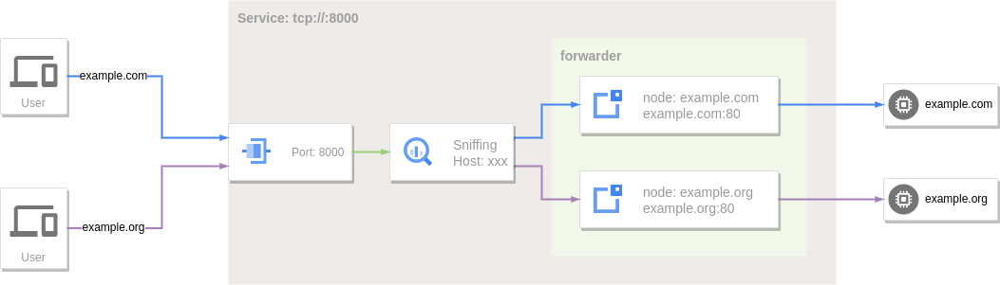
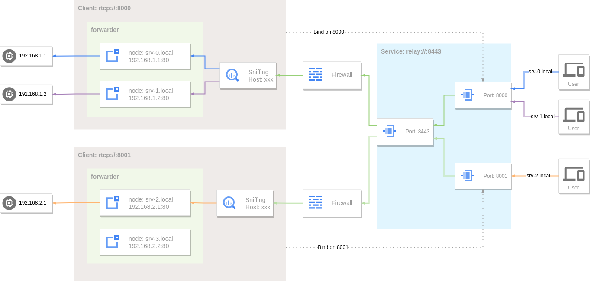
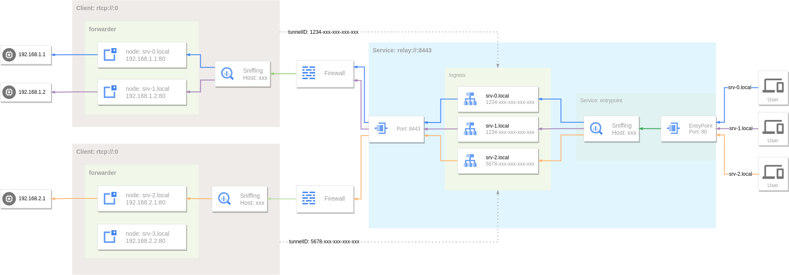

---
authors:
  - ginuerzh
categories:
  - Reverse Proxy
readtime: 30
date: 2023-01-16
comments: true
---

# Reverse Proxy and Intranet Penetration

Reverse proxy is a type of proxy service. In common proxy services like HTTP/SOCKS5 proxies, the proxy targets the client — the proxy acts on behalf of the client to connect to the target server. In reverse proxy, the proxy targets the server. This is why HTTP/SOCKS5 proxies are also called forward proxies. The main difference is that in forward proxy, the client knows about the proxy, while in reverse proxy, the client (and even the server) may not know about the proxy — to the client, the proxy appears to be the actual service being accessed.

From a certain perspective, reverse proxy and port forwarding are similar — both create a mapping between two ports, forwarding data from one to another. However, reverse proxy uses the forwarded data for more precise control, while port forwarding typically doesn't depend on data content and is purely end-to-end forwarding. GOST's reverse proxy is built on port forwarding.

<!-- more -->

GOST has supported [port forwarding](https://v2.gost.run/port-forwarding/) since v2.1. This feature remained largely unchanged until v3.0.0-rc.1, when port forwarding was extended to implement [reverse proxy](https://gost.run/tutorials/reverse-proxy/).

## Reverse Proxy

GOST's port forwarding originally didn't parse forwarded data. Reverse proxy, especially for web services, typically needs to route traffic based on the hostname (or domain name). This hostname must be extracted from the forwarded data — for HTTP traffic, it's the Host header; for HTTPS traffic, it's the SNI in the TLS handshake.



When a GOST port forwarding service enables sniffing, it can parse the data to extract the target hostname, then match it against the forwarder's defined targets. This makes port forwarding behave more like an [SNI proxy](https://gost.run/tutorials/protocols/sni/), except that an SNI proxy is more like a forward proxy (no restrictions on target hosts), while reverse proxy targets are typically a predefined set of services.

```yaml hl_lines="7 14 17"
services:
- name: service-0
  addr: :80
  handler:
    type: tcp
    metadata:
      sniffing: true
  listener:
    type: tcp
  forwarder:
    nodes:
    - name: example-com
      addr: example.com:80
      host: example.com
    - name: example-org
      addr: example.org:80
      host: example.org
```

```bash
curl --resolve example.com:80:127.0.0.1 http://example.com
```

The reverse proxy acts as a mirror of the target host (example.com). Accessing the proxy is no different from accessing the target.

## Intranet Penetration

The prerequisite for reverse proxy is that it can directly reach the target host. If the target is on an intranet without a public IP, this approach fails. Intranet penetration addresses this by having the intranet host proactively establish a connection to a public IP host. When data is sent to the public IP host, it's forwarded through this connection to the intranet target.



GOST's remote port forwarding handles this. It also supports traffic sniffing for hostname-based routing.

```yaml hl_lines="7 15 18"
services:
- name: http
  addr: :80
  handler:
    type: rtcp
    metadata:
      sniffing: true
  listener:
    type: rtcp
    chain: chain-0
  forwarder:
    nodes:
    - name: srv-0
      addr: 192.168.1.1:80
      host: srv-0.local
    - name: srv-1
      addr: 192.168.1.2:80
      host: srv-1.local
chains:
- name: chain-0
  hops:
  - name: hop-0
    nodes:
    - name: node-0
      addr: SERVER_IP:8443
      connector:
        type: tunnel
      dialer:
        type: tcp
```

```bash
curl --resolve srv-1.local:80:SERVER_IP http://srv-1.local
```

## Intranet Penetration — Enhanced

The above approach implements basic reverse proxy, but has limitations for web services requiring intranet penetration. Typical web reverse proxies (like Nginx, Traefik) expose only a few fixed predefined ports (e.g., 80, 443) as entry points, and traffic routing control belongs on the server side. With the above remote port forwarding, both the entry point and routing are defined on the client side, making the service unmanageable.



In v3.0.0-rc.3, GOST enhanced intranet penetration by extending the [Relay protocol](https://gost.run/tutorials/protocols/relay/) for better reverse proxy support.

### Server Side

```yaml hl_lines="7 8"
services:
- name: service-0
  addr: :8443
  handler:
    type: tunnel
    metadata:
      entrypoint: ":80"
      ingress: ingress-0
  listener:
    type: tcp

ingresses:
- name: ingress-0
  rules:
  - hostname: "srv-0.local"
    endpoint: 4d21094e-b74c-4916-86c1-d9fa36ea677b
  - hostname: "srv-1.local"
    endpoint: 4d21094e-b74c-4916-86c1-d9fa36ea677b
  - hostname: "srv-2.local"
    endpoint: ac74d9dd-3125-442a-a7c1-f9e49e05faca
```

### Client Side

```yaml hl_lines="29"
services:
- name: service-0
  addr: :0
  handler:
    type: rtcp
    metadata:
      sniffing: true
  listener:
    type: rtcp
    chain: chain-0
  forwarder:
    nodes:
    - name: local-0
      addr: 192.168.1.1:80
      host: srv-0.local
    - name: local-1
      addr: 192.168.1.2:80
      host: srv-1.local
chains:
- name: chain-0
  hops:
  - name: hop-0
    nodes:
    - name: node-0
      addr: SERVER_IP:8443
      connector:
        type: tunnel
        metadata:
          tunnel.id: 4d21094e-b74c-4916-86c1-d9fa36ea677b
      dialer:
        type: tcp
```

### EntryPoint

The entry point specifies the traffic ingress. All user traffic enters through the entry point. The handler creates an internal service listening on the entry point, which sniffs traffic to extract the target hostname and route accordingly.

### Tunnel

A tunnel is a (logical) channel established between the client and server for intranet penetration. Each tunnel has a unique ID (a valid UUID). A tunnel can have multiple connections — when multiple clients connect with the same tunnel ID, they belong to the same tunnel. The server selects an available connection from the tunnel for data forwarding.

### Ingress

[Ingress](https://gost.run/concepts/ingress/) defines routing rules for traffic entering through the entry point. Each rule maps a hostname to a tunnel. For example, traffic to `srv-0.local` and `srv-1.local` is routed to tunnel `4d21094e-b74c-4916-86c1-d9fa36ea677b`, while traffic to `srv-2.local` is routed to tunnel `ac74d9dd-3125-442a-a7c1-f9e49e05faca`.

!!! note "Tunnel ID Assignment"
    Tunnel IDs should be pre-assigned by the server and recorded in the Ingress. If a client uses a tunnel ID not registered in the Ingress, traffic cannot be routed to that client.

### Encryption

Tunnels rely on the Relay protocol, which does not provide built-in encryption. Encryption can be achieved by combining it with encrypted [data channels](https://gost.run/tutorials/protocols/overview/#_5) such as TLS, gRPC, or QUIC.
