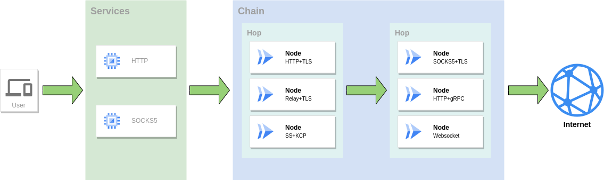
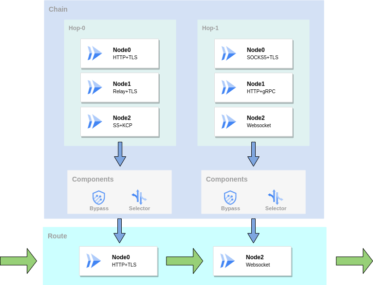
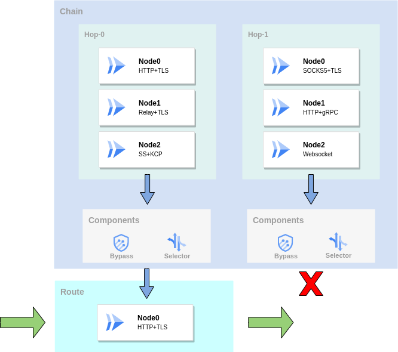
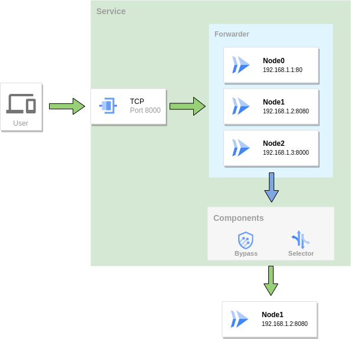

# Load Balancing

## Forwarding Chain

In GOST, if there is a forwarding chain after the traffic reaches the service, the traffic will be forwarded to the target address through the forwarding chain. A forwarding chain is composed of one or more levels of hops. Each hop can contain one or more nodes, and the nodes are independent of each other.

Before traffic is handed over to the forwarding chain, the forwarding chain needs to determine a forwarding path(Route). If there are multiple nodes in the hop, a qualified node needs to be selected from these nodes as a node of the route. GOST will select a node through the [Bypass](bypass.md) and [Selector](selector.md) at each hop in turn.

First, the bypass will filter the hop and nodes based on the target address. For a bypass on a hop, if the test fails then the route terminates at and does not include this hop. For bypass on a node, if the test fails the node will be filtered out. Then select a node from the remaining nodes based on the selector.

## Forwarder

For [port forwarding](../tutorials/port-forwarding.md) services, multiple target nodes can be specified through Forwarder. When the traffic reaches the forwarding service, if there are multiple target nodes in the forwarder, one of them also needs to be selected as the final forwarding target. Similar to forwarding chain, bypass and selector are also used in forwarder to determine the final node.

For [reverse proxy](../tutorials/reverse-proxy.md), it is slightly more complicated. Based on the above node filtering, it can be filtered through some additional information on the node. For example, HTTP traffic can be filtered through the host name or URL path information on the node.