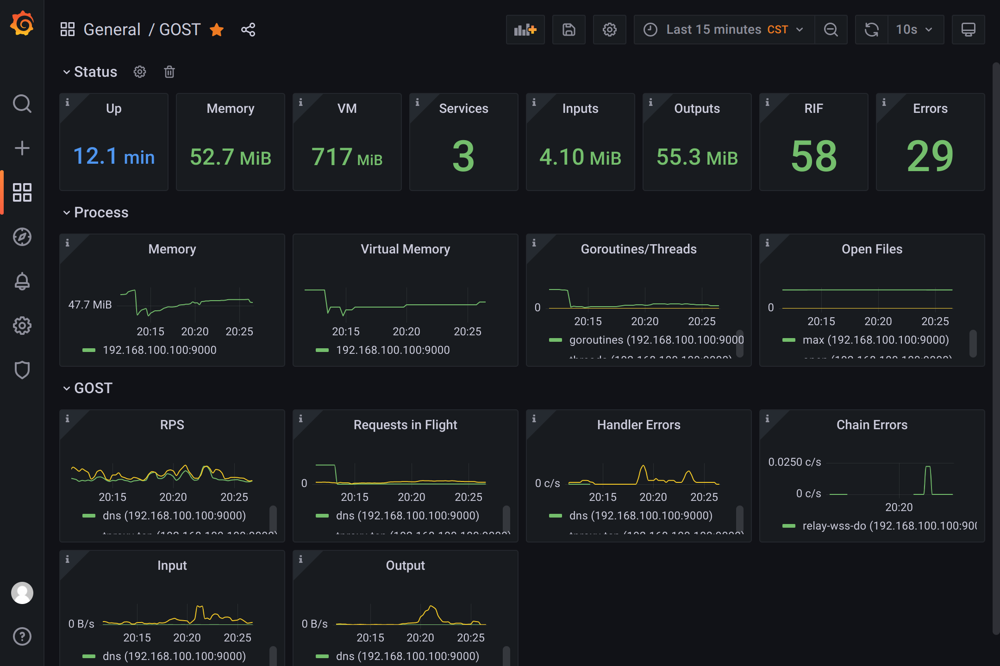

# Prometheus Metrics

GOST internally provides monitoring data through the [Prometheus](https://prometheus.io/) metrics.

## Enable Metrics

Use the `metrics` option to enable metrics, which is disabled by default.

=== "CLI"

	```bash
	gost -L :8080 -metrics=:9000
	```

	or

	```bash
	gost -L :8080 -metrics "user:pass@:9000?path=/metrics"
	```

=== "File (YAML)"

    ```yaml
	services:
	- name: service-0
	  addr: ":8080"
	  handler:
		type: auto
	  listener:
		type: tcp

	metrics:
	  addr: :9000
	  path: /metrics
	  auth:
	    username: user
		password: pass
	  auther: auther-0
	```

	`metrics.addr` (string)
	:    Metrics HTTP API service addresss

	`metrics.path` (string, default=/metrics)
	:    API path

### Authentication

Authentication uses [HTTP Basic Auth](https://en.wikipedia.org/wiki/Basic_access_authentication).

Authentication information can be set through the `auth` or `auther` option. If the `auther` option is set, the `auth` option is ignored. 

=== "CLI"

    ```bash
    gost -L :8080 -metrics "user:pass@:9000"
    ```

=== "File (YAML)"

    ```yaml
    metrics:
      addr: :9000
      auth:
        username: user
        password: pass
      auther: auther-0
    ```

After enabling, you can view the metrics data through the `http://localhost:9000/metrics` endpoint.

!!! example "Metrics"
    ```
    gost_chain_errors_total{chain="chain-0",host="host-0"} 1

	gost_service_handler_errors_total{host="host-0",service="service-0"} 1

	gost_service_request_duration_seconds_bucket{host="host-0",service="service-0",le="0.005"} 0
	gost_service_request_duration_seconds_bucket{host="host-0",service="service-0",le="0.01"} 0
	gost_service_request_duration_seconds_bucket{host="host-0",service="service-0",le="0.025"} 0
	gost_service_request_duration_seconds_bucket{host="host-0",service="service-0",le="0.05"} 0
	gost_service_request_duration_seconds_bucket{host="host-0",service="service-0",le="0.1"} 0
	gost_service_request_duration_seconds_bucket{host="host-0",service="service-0",le="0.25"} 1
	gost_service_request_duration_seconds_bucket{host="host-0",service="service-0",le="0.5"} 1
	gost_service_request_duration_seconds_bucket{host="host-0",service="service-0",le="1"} 1
	gost_service_request_duration_seconds_bucket{host="host-0",service="service-0",le="2.5"} 1
	gost_service_request_duration_seconds_bucket{host="host-0",service="service-0",le="5"} 1
	gost_service_request_duration_seconds_bucket{host="host-0",service="service-0",le="10"} 1
	gost_service_request_duration_seconds_bucket{host="host-0",service="service-0",le="15"} 1
	gost_service_request_duration_seconds_bucket{host="host-0",service="service-0",le="30"} 2
	gost_service_request_duration_seconds_bucket{host="host-0",service="service-0",le="60"} 2
	gost_service_request_duration_seconds_bucket{host="host-0",service="service-0",le="+Inf"} 2
	gost_service_request_duration_seconds_sum{host="host-0",service="service-0"} 15.172895206
	gost_service_request_duration_seconds_count{host="host-0",service="service-0"} 2

	gost_service_requests_in_flight{host="host-0",service="service-0"} 0

	gost_service_requests_total{host="host-0",service="service-0"} 2

	gost_service_transfer_input_bytes_total{host="host-0",service="service-0"} 1018

	gost_service_transfer_output_bytes_total{host="host-0",service="service-0"} 7327

	gost_services{host="host-0"} 1
	```

## Metrics Description

`gost_services` (type=gauge)
:    Current number of services

`gost_service_requests_total` (type=counter)
:    Total number of requests

`gost_service_transfer_input_bytes_total` (type=counter)
:    Total service input data transfer size in bytes

`gost_service_transfer_output_bytes_total` (type=counter)
:    Total service output data transfer size in bytes

`gost_service_requests_in_flight` (type=gauge)
:    Current in-flight requests

`gost_service_request_duration_seconds_*` (type=histogram)
:    Distribution of request latencies

`gost_service_handler_errors_total` (type=counter)
:    Total service handler errors

`gost_chain_errors_total` (type=counter)
:    Total chain connection errors

## Prometheus

Example of prometheus configuration file `prometheus.yaml`:

```yaml hl_lines="5 6 7 8"
global:
  scrape_interval: 15s 
# A list of scrape configurations.
scrape_configs:
  - job_name: 'gost'
    scrape_interval: 5s
    static_configs:
      - targets: ['127.0.0.1:9000']
```

## Grafana Dashboard

You can use the following Dashboard to present metrics data.

[https://grafana.com/grafana/dashboards/16037](https://grafana.com/grafana/dashboards/16037)

