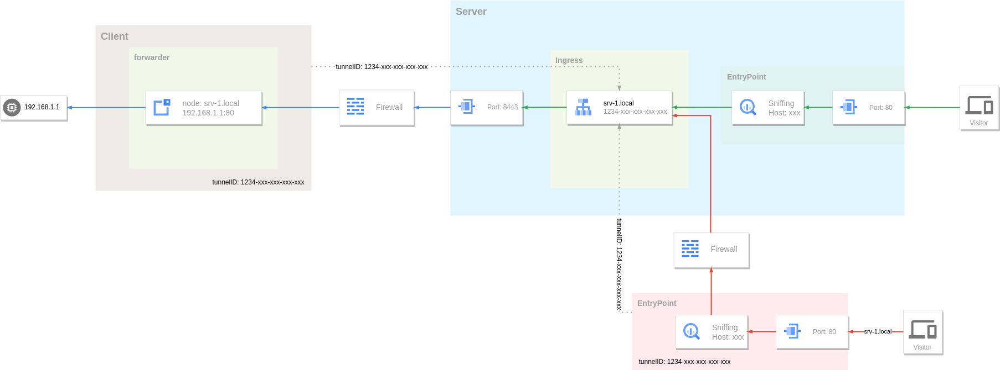
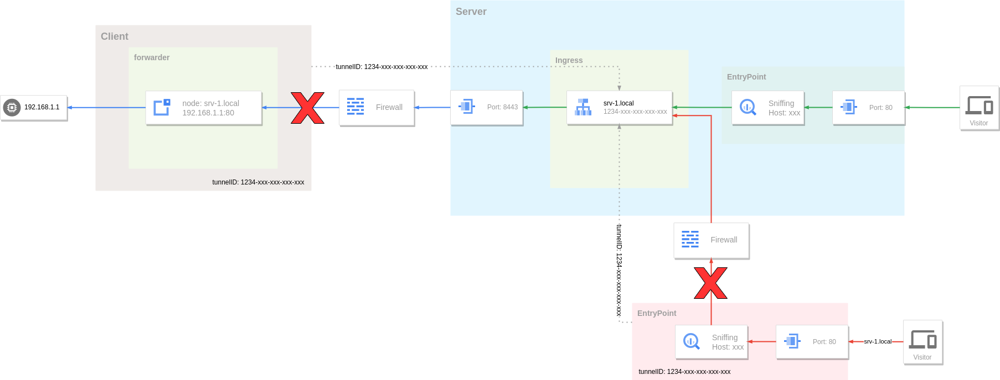
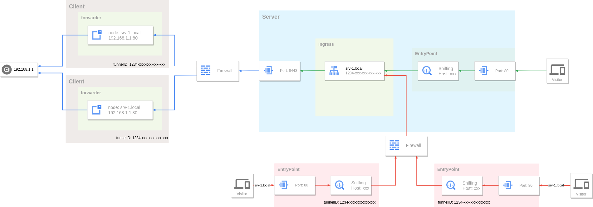
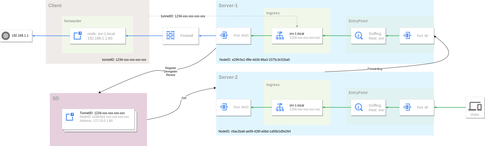

# Reverse Proxy Tunnel - High Availability

In the previous [Reverse Proxy Tunnel](reverse-proxy-tunnel.md) tutorial, the functions and usage of reverse proxy tunnels were described in detail. In this tutorial, we will focus on the deployment and the high availability of the system.

## Single Point Of Failure

A reverse proxy tunnel system consists of three parts:

* Server - Reverse proxy tunnel server, responsible for tunnel management and traffic routing.
* Client - Establishes a tunnel connection with the server, receives traffic from the server, routes and forwards it to the target host again.
* Visitor - The visitor forwards the request to the server through the entry point, and the server then routes the traffic to the client of the corresponding tunnel, and finally reaches the target host.

 

There is a [single point of failure (SPOF)](https://en.wikipedia.org/wiki/Single_point_of_failure) problem in the above system. When any one of the three parts fails, the tunnel becomes unavailable. For example, in the figure below, when the client network fails to establish a tunnel connection with the server, or the entry point cannot connect to the service, its corresponding tunnel becomes inaccessible.



A mature solution to solving SPOF is to allow every part of the system to be horizontally scalable. By running multiple instances to form a cluster, when a single instance in the cluster fails, other instances can continue to operate, thereby achieving high availability of the entire system. Single point problems on the client and visitor side can be solved simply by running multiple instances.



A single tunnel in a reverse proxy tunnel supports multiple connections by running multiple clients and specifying the same tunnel ID. Multiple connections form a connection pool on the tunnel server. The server uses these connections in a round-robin manner. When it detects a client connection exception, it will remove the connection from the connection pool. Visitor can also increase availability by running multiple entry points.

Clients and visitors are stateless, so they can be easily scaled horizontally. However, the server cannot simply do this. The server needs to maintain the status of each tunnel, and the tunnel itself cannot be automatically migrated or copied as the server expands.


As shown in the figure above, two server instances are running, and the client is connected to Server-1. At this time, if the request from the visitor is sent to Server-2, routing fails because there is no tunnel connection in Server-2. The server needs some additional means to achieve scalability.

## Service Registry and Discovery

The reason why the server cannot achieve horizontal scaling is that the server instances are independent of each other and cannot perceive the tunnel information in other instances. Therefore we need a way for the server to share all client tunnel and connection information. The reverse proxy tunnel server achieves this goal through [service registry and discovery](../concepts/sd.md) mechanisms, but it does not integrate specific service registry and discovery functional modules. Instead, the functions are opened through plugins, and the user chooses the implementation method.



When the client connects to the tunnel server, the server will send the client's connection information to the plugin (Register). The server will regularly check the connection status and report (Renew) to the plugin to maintain the validity of the connection information. When the client disconnects, the server will also report the plugin (Deregister).

When the visitor request reaches the server, the server first trys to obtains the tunnel connection from its own connection pool. If it is not found, it will query the plugin again (Get), and the plugin will return the connection list of the corresponding tunnel. Each connection information contains the server node address (entry point) where the connection is located, and the server eventually forwards the request to other instances for processing.

## Cloud Native Deployment

When all parts of the system can be scaled horizontally, they can be deployed flexibly with the help of cloud-native platforms such as Kubernetes. The following is a complete high-availability reverse proxy tunnel system deployment example, in which the plugin parts of Ingress routing and service discovery are supported by the redis service.

The client connects to the tunnel server through the domain name `gost.local`:

```bash
gost -L file://:8000 -L rtcp://:0/:8000 -F tunnel+ws://gost.local:80?tunnel.id=381433e1-7980-11ee-bbdb-60f262c1e32d
```

Then you can access it through `http://b7de88a94729b931.gost.local`.

??? example "deploy.yaml"

    ```yaml
    apiVersion: v1
    kind: Namespace
    metadata:
      name: tunnel
    ---
    apiVersion: v1
    kind: Service
    metadata:
      name: redis
      namespace: tunnel
    spec:
      selector:
        app: redis
      ports:
        - name: tcp
          protocol: TCP
          port: 6379
          targetPort: tcp
    ---
    apiVersion: v1
    kind: Service
    metadata:
      name: gost-tunnel
      namespace: tunnel
    spec:
      selector:
        app: gost-tunnel
      ports:
        - name: tunnel
          protocol: TCP
          port: 8421
          targetPort: tunnel
        - name: entrypoint
          protocol: TCP
          port: 80
          targetPort: entrypoint
    ---
    apiVersion: v1
    kind: Service
    metadata:
      name: ingress-plugin
      namespace: tunnel
    spec:
      selector:
        app: ingress-plugin
      ports:
        - name: tcp
          protocol: TCP
          port: 8000
          targetPort: tcp
    --- 
    apiVersion: v1
    kind: Service
    metadata:
      name: sd-plugin
      namespace: tunnel
    spec:
      selector:
        app: sd-plugin
      ports:
        - name: tcp
          protocol: TCP
          port: 8000
          targetPort: tcp
    --- 
    apiVersion: v1
    kind: ConfigMap
    metadata:
      name: gost-tunnel
      namespace: tunnel
    data:
      gost.yaml: |
        services:
        - name: service-0
          addr: :8421
          handler:
            type: tunnel
            metadata:
              entrypoint: :80
              ingress: ingress-0
              sd: sd-0
          listener:
            type: ws
    
        ingresses:
        - name: ingress-0
          plugin:
            type: grpc
            addr: ingress-plugin:8000
        
        sds:
        - name: sd-0
          plugin:
            type: grpc
            addr: sd-plugin:8000
    
        log:
          level: debug
    ---
    apiVersion: apps/v1
    kind: Deployment
    metadata:
      name: gost-tunnel
      namespace: tunnel
    spec:
      replicas: 3
      selector:
        matchLabels:
          app: gost-tunnel
      template:
        metadata:
          name: gost-tunnel
          labels:
            app: gost-tunnel
        spec:
          containers:
            - name: gost
              image: gogost/gost
              ports:
                - name: tunnel
                  containerPort: 8421
                  protocol: TCP
                - name: entrypoint
                  containerPort: 80
                  protocol: TCP
              resources:
                limits:
                  cpu: 1000m
                  memory: 500Mi
                requests:
                  cpu: 100m
                  memory: 100Mi
              volumeMounts:
                - name: config
                  mountPath: /etc/gost
                  readOnly: true
          volumes:
            - name: config
              configMap:
                name: gost-tunnel
          restartPolicy: Always
      strategy:
        type: RollingUpdate
        rollingUpdate:
          maxUnavailable: 0
          maxSurge: 1
      minReadySeconds: 10
    ---
    apiVersion: apps/v1
    kind: Deployment
    metadata:
      name: ingress-plugin
      namespace: tunnel
    spec:
      replicas: 1
      selector:
        matchLabels:
          app: ingress-plugin
      template:
        metadata:
          name: ingress-plugin
          labels:
            app: ingress-plugin
        spec:
          containers:
            - name: plugin
              image: ginuerzh/gost-plugins
              args:
              - "ingress"
              - "--addr=:8000"
              - "--redis.addr=redis:6379"
              - "--redis.db=1"
              - "--redis.expiration=1h"
              - "--domain=gost.local"
              - "--log.level=debug"
              ports:
                - name: tcp
                  containerPort: 8000
                  protocol: TCP
              resources:
                limits:
                  cpu: 1000m
                  memory: 500Mi
                requests:
                  cpu: 100m
                  memory: 100Mi
          restartPolicy: Always
      strategy:
        type: RollingUpdate
        rollingUpdate:
          maxUnavailable: 0
          maxSurge: 1
      minReadySeconds: 10
    ---
    apiVersion: apps/v1
    kind: Deployment
    metadata:
      name: sd-plugin
      namespace: tunnel
    spec:
      replicas: 1
      selector:
        matchLabels:
          app: sd-plugin
      template:
        metadata:
          name: sd-plugin
          labels:
            app: sd-plugin
        spec:
          containers:
            - name: plugin
              image: ginuerzh/gost-plugins
              args:
              - "sd"
              - "--addr=:8000"
              - "--redis.addr=redis:6379"
              - "--redis.db=2"
              - "--redis.expiration=3m"
              - "--log.level=debug"
              ports:
                - name: tcp
                  containerPort: 8000
                  protocol: TCP
              resources:
                limits:
                  cpu: 1000m
                  memory: 500Mi
                requests:
                  cpu: 100m
                  memory: 100Mi
          restartPolicy: Always
      strategy:
        type: RollingUpdate
        rollingUpdate:
          maxUnavailable: 0
          maxSurge: 1
      minReadySeconds: 10
    ---
    apiVersion: apps/v1
    kind: Deployment
    metadata:
      name: redis
      namespace: tunnel
    spec:
      replicas: 1
      selector:
        matchLabels:
          app: redis
      template:
        metadata:
          name: redis
          labels:
            app: redis
        spec:
          restartPolicy: Always
          containers:
            - name: redis
              image: redis:7.2-alpine
              ports:
                - name: tcp
                  containerPort: 6379
                  protocol: TCP
              resources:
                limits:
                  cpu: 1000m
                  memory: 1000Mi
                requests:
                  cpu: 10m
                  memory: 100Mi
              livenessProbe:
                exec:
                  command:
                    - redis-cli
                    - ping
                initialDelaySeconds: 30
                timeoutSeconds: 5
                periodSeconds: 15
                successThreshold: 1
                failureThreshold: 3
              imagePullPolicy: IfNotPresent
    ---
    apiVersion: networking.k8s.io/v1
    kind: Ingress
    metadata:
      name: tunnel
      namespace: tunnel
    spec:
      rules:
        - host: gost.local
          http:
            paths:
              - path: /
                pathType: Prefix
                backend:
                  service:
                    name: gost-tunnel
                    port:
                      name: tunnel
        - host: '*.gost.local'
          http:
            paths:
              - path: /
                pathType: Prefix
                backend:
                  service:
                    name: gost-tunnel
                    port:
                      name: entrypoint
    ```
    
    
    
    